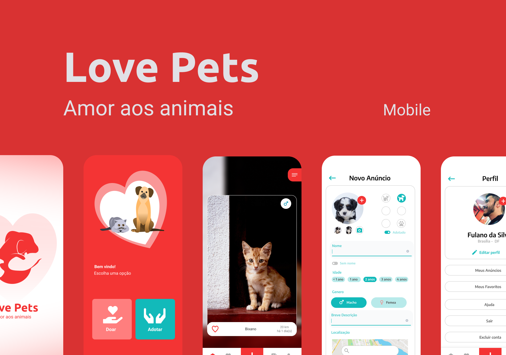

<h3 align="center">
  
</h3>

<h2 align="center">
 Love Pets: amor aos animais 
</h2>

<h3 align="center">
  Aplicação para conectar pessoas que desejam doar e ou adotar pets
</h3>

<p align="center">
  
  
  <a href="https://www.linkedin.com/in/jefferson-c-silva-aa1b7b1a9/">
    
  </a>
</p>

<p align="center">
  
</p>

## 💻 Projeto

Love pets: amor aos animais, é um projeto que tem como ideia conectar pessoas que desejam adotar ou doar pets baseado na localidade do usuário. Essa é a versão mobile da aplicação.

## 🚀 Tecnologias

- TypeScript
- React Native
- Styled Components
- Firebase

## 🚀 Features

- O usuário poderá se cadastrar ou efetuar o login social com o google ou facebook.

- O usuário terá acesso aos anúncios de adoção próximo ao local onde ele está.

- O usuário poderá filtrar por especie, gênero e distância de alcance dos anúncios.

- O usuário logado poderá, salvar anúncios como favoritos, cadastrar, aditar e excluir anúncios.

- O usuário poderá compartilhar e denunciar o anúncio, assim como entrar em contato com o responsável pelo anúncio via whatsapp.

- O usuário também poderá alterar informações do seu perfil e excluir sua conta.


## ℹ️ How To Use

```bash
# Clone this repository
$ git clone https://github.com/Jefferson00/LovePetsMobileBeta

# Go into the repository
$ cd LovePetsMobileBeta

# Install dependencies
$ yarn install

# Run
$ yarn start
$ yarn android or yarn ios

```

## 📝 License

<a href="/LICENSE">
    
 </a>

Made with ♥ by Jefferson C Silva :wave: [Get in touch!](https://www.linkedin.com/in/jefferson-c-silva)